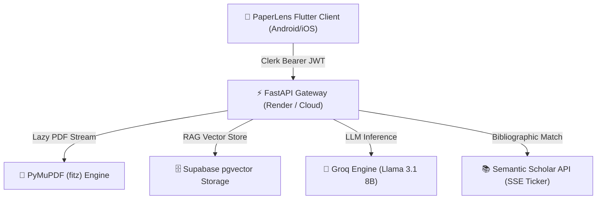

# PaperLens AI 🔬⚡

<p align="center">
  
</p>

<p align="center">
  <b>Production-Grade AI Research Intelligence & Paper Exploration Ecosystem</b>
  <br />
  <i>Understand papers faster • Discover unaddressed literature gaps • Generate novel research roadmaps</i>
</p>

<p align="center">
  <a href="https://flutter.dev"></a>
  <a href="https://fastapi.tiangolo.com"></a>
  <a href="https://supabase.com"></a>
  <a href="https://groq.com"></a>
  <a href="https://clerk.com"></a>
</p>

---

## 📖 Overview

**PaperLens AI** is an end-to-end, production-ready research intelligence platform designed for researchers, PhD scholars, and R&D engineers. Unlike generic document Q&A tools, PaperLens AI provides **7 specialized AI workflow studios**:

1. **📄 Paper Analyzer Studio:** Streamed PDF/DOCX parsing, pointwise structured analysis, and contextual multi-turn Q&A.
2. **🗂 Citation Intelligence Studio:** 4-stage reference verification with real-time SSE progress tickers, Analytics Rail (2x2 metrics grid + interactive year distribution chips), and on-demand AI Reading Roadmaps.
3. **🔍 Gap Detection Engine:** Automated literature scan uncover unstated assumptions, weak baselines, and high-impact open research directions (with high/med/low severity classification & remediation callouts).
4. **💡 Problem Generator Studio:** Formulates novel hypotheses, novelty ratings (`⭐ 4.8 / 5.0`), and expands surface ideas into complete execution briefs.
5. **📊 Dataset & Benchmark Finder:** Curated matching of SOTA evaluation datasets, benchmark leaderboards, and recommended technology frameworks.
6. **🧪 Experiment Planner Studio:** Converts research topics into staged methodology execution roadmaps tailored by difficulty level (*Beginner*, *Intermediate*, *Advanced / PhD*).
7. **⚙️ Researcher Workspace Settings:** Enterprise account management, profile preferences, dark glassmorphism theme, and saved workspace items.

---

## 🏗 System Architecture & Backend Integration

PaperLens AI follows a decoupled, resilient client-server architecture optimized for cloud deployment and instant mobile responsiveness.



### 🔗 Backend Repository & Live Endpoint
- **Live Production API Gateway:** `https://paperlens-ai-phn3.onrender.com`
- **Backend Source Repository:** [https://github.com/arpanpramanik2003/PaperLens-AI/tree/master/backend](https://github.com/arpanpramanik2003/PaperLens-AI/tree/master/backend)

---

## 🛠 Features & Studio Workflows

### 📄 1. Paper Analyzer Studio
- **Structured Alignment:** Justified output formatting with custom pointwise bullet badges (`*`, `-`, `•`, `1.`, `2.`).
- **Interactive Q&A:** Multi-turn conversational thread persistence with quick prompt chips.
- **Zero Bouncing Boxes:** Predictable container bounds ensuring 100% static layout stability.

### 🗂 2. Citation Intelligence Studio
- **Analytics Rail:** Interactive 2x2 metrics grid (`PROCESSED`, `MATCHED`, `MISSING`, `YEAR BUCKETS`) and clickable year distribution chips.
- **SSE Real-time Progress Ticker:** Live status ticker streaming citation verification steps.
- **AI Reading Roadmap:** On-demand recommendation engine organizing essential papers by impact.

### 🔍 3. Gap Detection Engine
- **Dual Input Modes:** Project plan text area vs PDF/DOCX paper file dropzone.
- **Severity Badging:** Color-coded classification (`HIGH RISK`, `MEDIUM SEVERITY`, `LOW RISK`).
- **Remediation Suggestions:** Actionable suggestion callout boxes for closing research gaps.

### 💡 4. Problem Generator Studio
- **Domain Presets:** Single-tap domain presets (*LLM Reasoning*, *Computer Vision*, *Medical Imaging*, *Robotics*, *Bioinformatics*).
- **Novelty Ratings:** Displays rating stars (`⭐ 4.8 / 5.0`) alongside proposal titles.

### 📊 5. Dataset & Benchmark Finder
- **Asset Intelligence:** Matches evaluation datasets, leaderboards, baseline metrics, and hardware requirements.
- **Tech Stack Grid:** Recommended tools categorized by *Framework*, *Library*, *MLOps*, and *Tool*.

### 🧪 6. Experiment Planner Studio
- **Staggered Roadmap:** Formulates staged milestone blueprints with parameters, evaluation metrics, and risk checkpoints.

---

## 💻 Tech Stack Overview

| Component | Technologies |
|---|---|
| **Mobile Client** | Flutter 3.27+, Dart, Google Fonts, Flutter Animate |
| **Authentication** | Clerk Single Sign-On (Clerk Flutter SDK) |
| **Backend Gateway** | Python 3.10+, FastAPI, Uvicorn, Pydantic |
| **Vector Storage (RAG)** | Supabase `pgvector` Remote Storage + local FAISS fallback |
| **LLM Inference** | Groq Cloud (`llama-3.1-8b-instant`) |
| **PDF Extraction** | PyMuPDF (`fitz`) Generator Streaming |
| **Bibliographic Search** | Semantic Scholar Academic Graph API |

---

## 🚀 Quick Setup & Build Instructions

### Prerequisites
- Flutter SDK (3.20.0 or higher)
- Android Studio / VS Code with Flutter extension
- Android Device or Emulator

### 1) Environment Configuration
Create a `.env` file inside `paperlens_flutter/.env`:

```env
API_BASE_URL=https://paperlens-ai-phn3.onrender.com
CLERK_PUBLISHABLE_KEY=pk_test_...
```

### 2) Install Dependencies & Run App
```bash
cd paperlens_flutter
flutter pub get
flutter run
```

### 3) Compiling Release APK for Android
To build a standalone production release APK for Android:

```bash
cd paperlens_flutter
flutter build apk --release
```
The compiled APK will be generated at `paperlens_flutter/build/app/outputs/flutter-apk/app-release.apk`.

---

## ⚖️ License
Licensed under the [MIT License](LICENSE). Copyright (c) 2026 PaperLens AI Team.
