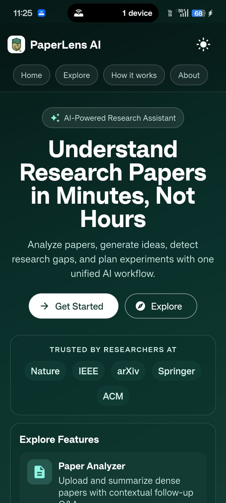

# PaperLens AI — Flutter Mobile Application 📱

<p align="center">
  
</p>

<p align="center">
  <b>Modern Cross-Platform Mobile Client for PaperLens AI Suite</b>
  <br />
  <i>Built with Flutter • Dark Glassmorphism Design • Clerk SSO Authentication</i>
</p>

---

## 📱 Features & Highlights

- **Clerk Single Sign-On:** Seamless user authentication and secure token synchronization using the official Clerk Flutter SDK.
- **Glassmorphism Design System:** Custom `SaaSTheme` tokens featuring dark space navy palettes, glowing radial highlights, and fluid micro-animations.
- **Zero Layout Bouncing:** Fixed-height progress containers (`SizedBox(height: 24)`) ensuring 100% static layout stability during AI generation.
- **Responsive Architecture:** Responsive `AppShellPage` adapting automatically between mobile horizontal `TabBar` navigation (height: 40px) and wide desktop sidebars (`AppSidebar`).

---

## 📂 Project Structure

```
paperlens_flutter/
├── .env                              <-- Environment Configuration
├── pubspec.yaml                      <-- Flutter Dependencies & Assets
├── analysis_options.yaml             <-- Linter & Code Quality Rules
├── assets/                           <-- Branding Images & Graphics
├── android/                          <-- Android Native Config & Manifest
├── ios/                              <-- iOS Native Project Configuration
├── test/                             <-- Automated Widget Test Suite
└── lib/
    ├── main.dart                     <-- App Entrypoint & Clerk Provider
    ├── services/
    │   └── api_service.dart          <-- FastAPI HTTP Client & Retries
    └── screens/
        ├── auth_landing_page.dart    <-- Authentication & Welcome Screen
        ├── app_shell_page.dart       <-- Main Navigation Shell
        ├── landing/
        │   └── landing_theme.dart    <-- Core Glassmorphism Theme Tokens
        └── post_signin/
            ├── app_header.dart       <-- User Avatar Header Banner
            ├── app_sidebar.dart      <-- Responsive Desktop Navigation
            └── feature_sections/
                ├── dashboard_section.dart
                ├── analyzer_section.dart
                ├── citation_intelligence_tab.dart
                ├── gap_detection_tab.dart
                ├── problem_generator_tab.dart
                ├── dataset_benchmark_tab.dart
                ├── planner_section.dart
                └── settings_tab.dart
```

---

## 🚀 Running & Building

### 1. Development Mode
```bash
flutter pub get
flutter run
```

### 2. Static Code Analysis
```bash
flutter analyze
```

### 3. Build Standalone Android APK
```bash
flutter build apk --release
```
The output file will be saved at:
`build/app/outputs/flutter-apk/app-release.apk`

---

## 🔗 Connected Backend & API Documentation

The Flutter mobile client communicates with the live FastAPI production server:
- **Production API Server:** `https://paperlens-ai-phn3.onrender.com`
- **Backend GitHub Source Code:** [https://github.com/arpanpramanik2003/PaperLens-AI/tree/master/backend](https://github.com/arpanpramanik2003/PaperLens-AI/tree/master/backend)
